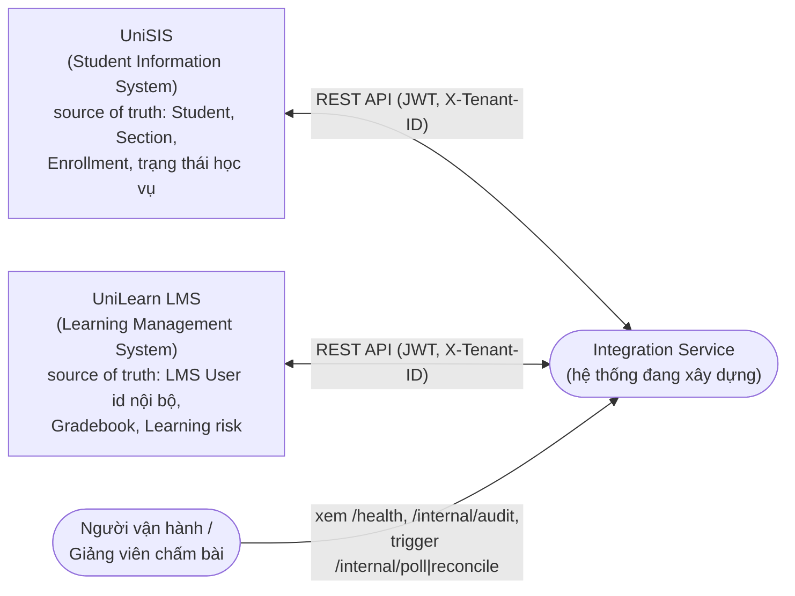
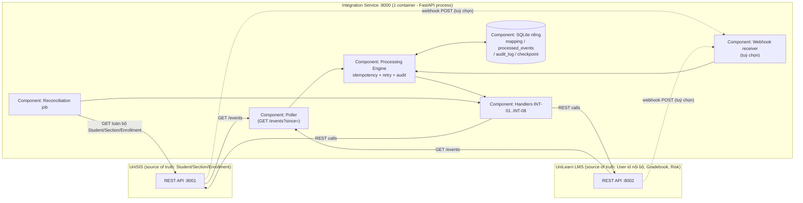

# Kiến trúc Integration Service (UniSIS ↔ UniLearn LMS)

## 1. Tổng quan

Integration Service là một thành phần **độc lập**, không sửa mã nguồn hay
truy cập trực tiếp database của UniSIS/UniLearn. Toàn bộ giao tiếp đi qua
REST API công khai của hai hệ thống, dùng JWT lấy từ `/api/v1/auth/token`.

## 2. Sơ đồ Context (C4 Level 1)

Phạm vi & ranh giới trách nhiệm ở mức hệ thống: Integration Service là
một "actor" trung gian, không có người dùng cuối trực tiếp — nó chỉ nói
chuyện với hai hệ thống nguồn/đích qua REST API công khai của họ.



**Ranh giới trách nhiệm:**
* Integration Service **không** lưu trữ dữ liệu nghiệp vụ gốc (Student,
  Section, Grade...) — chỉ lưu **mapping ID** và **trạng thái xử lý event**
  của riêng nó.
* Integration Service **không** ghi trực tiếp vào database của SIS/LMS —
  mọi thay đổi đều qua REST API công khai của hai hệ thống đó.
* SIS là source of truth cho dữ liệu hành chính/học vụ; LMS là source of
  truth cho ID nội bộ + hành vi học tập (xem bảng đầy đủ ở
  `final-report.md`, câu 2).

## 3. Sơ đồ Container/Component (C4 Level 2/3)



Mỗi "Component" trong sơ đồ trên tương ứng 1-1 với 1 module Python
trong `app/`, nên sơ đồ phản ánh đúng cấu trúc code thật, không phải sơ
đồ minh hoạ độc lập với implementation:

| Component trong sơ đồ | File mã nguồn |
|---|---|
| Poller | `app/poller.py` (`poll_loop`, `poll_source`) |
| Webhook receiver | `app/main.py` (`POST /webhooks/sis`, `POST /webhooks/lms`) |
| Processing Engine | `app/engine.py` (`process_event`, `retry_pending`) |
| Handlers INT-01..08 | `app/handlers.py` |
| Reconciliation job | `app/reconcile.py` |
| SQLite riêng | `app/db.py` |
| API client (SIS/LMS) | `app/clients.py` |
| Cấu hình | `app/config.py` |

## 4. Chế độ vận hành: Polling là chính, Webhook receiver có sẵn (hybrid)

Service mặc định chạy **polling** (`INTEGRATION_MODE=poll`):
mỗi `POLL_INTERVAL_SECONDS` giây, gọi `GET /api/v1/events?since=<checkpoint>`
trên cả hai hệ thống, xử lý tuần tự các event mới, rồi lưu checkpoint mới.

Service cũng có sẵn 2 endpoint `POST /webhooks/sis` và `POST /webhooks/lms`
và có thể bật `INTEGRATION_MODE=webhook` để tự đăng ký callback — nhưng
**polling được chọn làm cơ chế chính thức nộp bài** (xem Phụ lục C, câu 1
trong `final-report.md` để biết lý do và đánh đổi).

Vì `engine.process_event()` luôn kiểm tra idempotency trước khi xử lý,
polling và webhook có thể chạy song song mà không tạo dữ liệu trùng — đây
là lý do khiến kiến trúc thực chất là **hybrid an toàn**: polling đảm bảo
không bỏ sót event, webhook (nếu bật) chỉ làm giảm độ trễ.

## 5. Datastore riêng của Integration Service

Không đụng vào SQLite của SIS/LMS. Service có SQLite riêng
(`app/db.py`) với 4 bảng:

| Bảng | Vai trò |
|---|---|
| `id_mapping` | Student↔User, Section↔Course (khoá: entity_type, tenant, source_id) |
| `processed_events` | Idempotency ledger: trạng thái DONE/PENDING/FAILED theo (event_id, source) |
| `audit_log` | Một dòng cho mỗi lần xử lý/attempt (NFR-04) |
| `checkpoints` | `last_occurred_at` theo từng nguồn, dùng cho polling |

## 6. Pipeline xử lý (app/engine.py)

```
process_event(event_id, event_type, source, payload):
    nếu event_type không thuộc INT-01..08  -> IGNORED (bỏ qua an toàn)
    nếu processed_events[event_id,source].status == DONE -> SKIPPED (idempotent no-op)
    else:
        try: action = handler(payload)          # INT-0x logic
             -> DONE, audit SUCCESS
        except DependencyPendingError:            # thiếu mapping User/Course
             -> PENDING, audit RETRY (chờ dependency)
        except RetryableError (429/5xx/network):
             nếu retry_count > MAX_RETRIES -> FAILED, audit GIVE_UP_MAX_RETRIES
             else -> PENDING, next_retry_at = now + (Retry-After hoặc backoff mũ 2), audit RETRY_SCHEDULED
        except PermanentError (4xx nghiệp vụ):
             -> FAILED ngay lập tức, audit PERMANENT_ERROR (không retry vô hạn)
```

Một worker nền (`poller.retry_loop`) quét `processed_events` có
`status=PENDING AND next_retry_at <= now` mỗi `RETRY_WORKER_INTERVAL_SECONDS`
giây và gọi lại `process_event` — đây là cơ chế giải quyết cả retry lỗi
tạm thời lẫn dependency-pending (INT-03 chờ INT-01/02) bằng cùng một
pipeline duy nhất.

## 7. Idempotency (NFR-01)

Khoá idempotency là `eventId` do SIS/LMS phát ra (UUID trong envelope
event), **không phải** nội dung nghiệp vụ. Vì UniSIS/UniLearn đảm bảo
`eventId` duy nhất và ổn định cho một sự kiện dù được `GET /events` trả
về nhiều lần (poll trùng khoảng) hay webhook gửi lại (retry ở phía
nguồn), so sánh theo `(event_id, source)` là đủ để đảm bảo an toàn
"at-least-once nguồn -> exactly-once hiệu ứng phụ".

Với các trường hợp API đích tự báo trùng (`409 Conflict` khi tạo User/
Course đã tồn tại, do một tiến trình khác/đợt reconciliation trước đó
đã tạo), handler bắt riêng và coi là phục hồi thành công
(`RECOVERED_FROM_409_*`) thay vì lỗi.

## 8. Retry / Backoff / Rate-limit (NFR-02, NFR-03, NFR-12)

* 429: dùng đúng giá trị `Retry-After` do LMS/SIS trả về làm độ trễ retry
  (xem `clients.py::RetryableError.retry_after`, test
  `test_retry_after_header_is_respected`).
* 500/502/503/504/lỗi mạng: backoff mũ 2, base=`BACKOFF_BASE_SECONDS`,
  trần `BACKOFF_MAX_SECONDS`.
* Sau `MAX_RETRIES` lần, event chuyển `FAILED` (không lặp vô hạn) và ghi
  audit rõ lý do để người vận hành có thể tra cứu.
* 4xx nghiệp vụ (validate sai, not-found do dữ liệu bất thường) →
  `PermanentError`, `FAILED` ngay, không tốn chi phí retry vô ích.
* Reconciliation bulk (một lần quét toàn bộ dữ liệu) chủ động giãn cách
  (`RECONCILE_PACING_SECONDS`) để tránh tự đâm vào rate limit khi xử lý
  hàng trăm bản ghi liên tiếp.

## 9. Reconciliation (NFR-06)

`app/reconcile.py` dùng **lại chính các handler** của luồng event-driven
(`sync_student_to_lms_user`, `sync_section_to_lms_course`,
`sync_enrollment_to_membership`) để quét toàn bộ Student/Section/
Enrollment hiện có trong SIS, đảm bảo dữ liệu tạo ra trước khi
Integration Service tồn tại (GAP-11) cũng được đồng bộ, và tự sửa các
trường bị lệch (vd. `enabled` sau khi SIS đổi `status`).

## 10. Bảo mật & vận hành

* Secret (client secret, JWT) chỉ đọc từ biến môi trường (`.env`,
  không commit), không bao giờ được `log.info`/`log.warning` in ra
  (xem `clients.py` — log chỉ in `status_code`, không in body/token).
* Token JWT cache trong bộ nhớ tiến trình, tự refresh khi hết hạn hoặc
  gặp `401`.
* Header `X-Tenant-ID` gửi kèm mọi request để đảm bảo tenant isolation
  (NFR-08); Integration Service của mỗi nhóm chỉ thao tác trên tenant
  của mình.
* `GET /health` trả về trạng thái + số liệu tổng hợp (mapping, pending,
  failed) phục vụ health-check của Docker/orchestrator.
