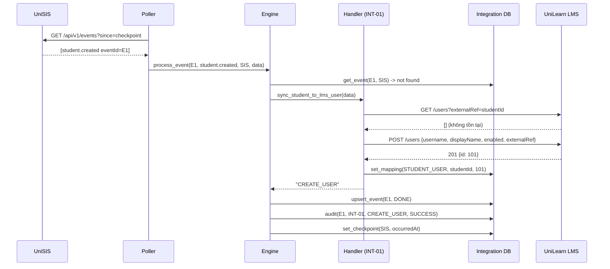
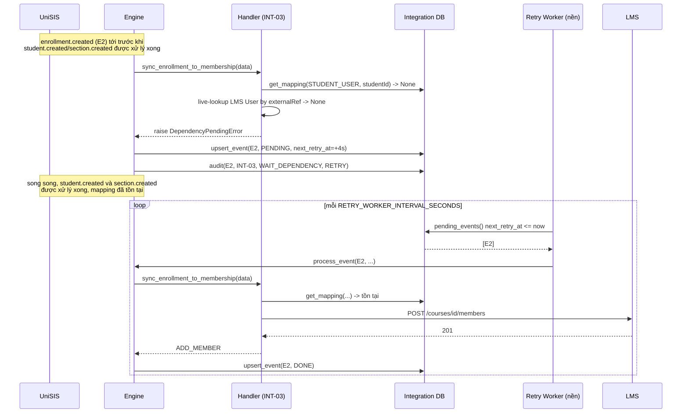
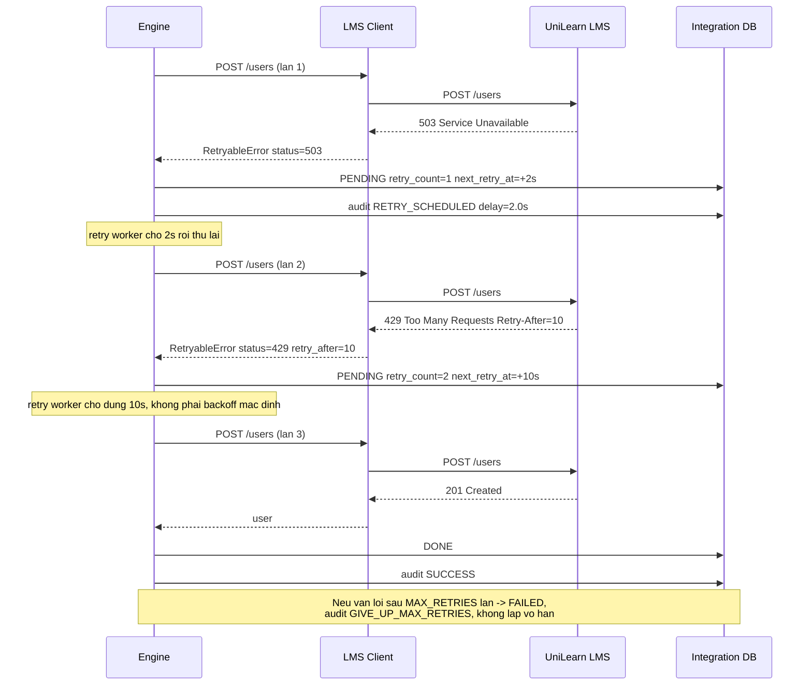
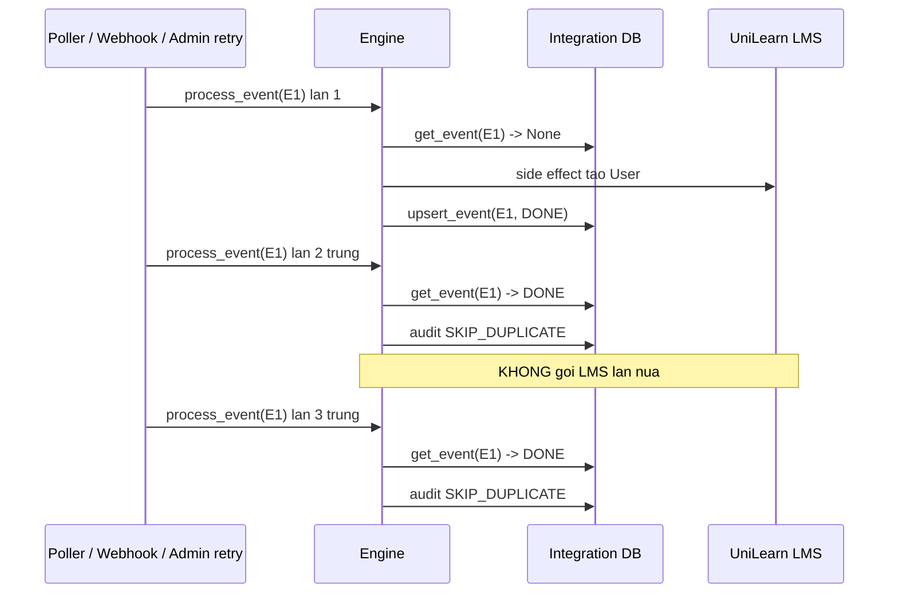
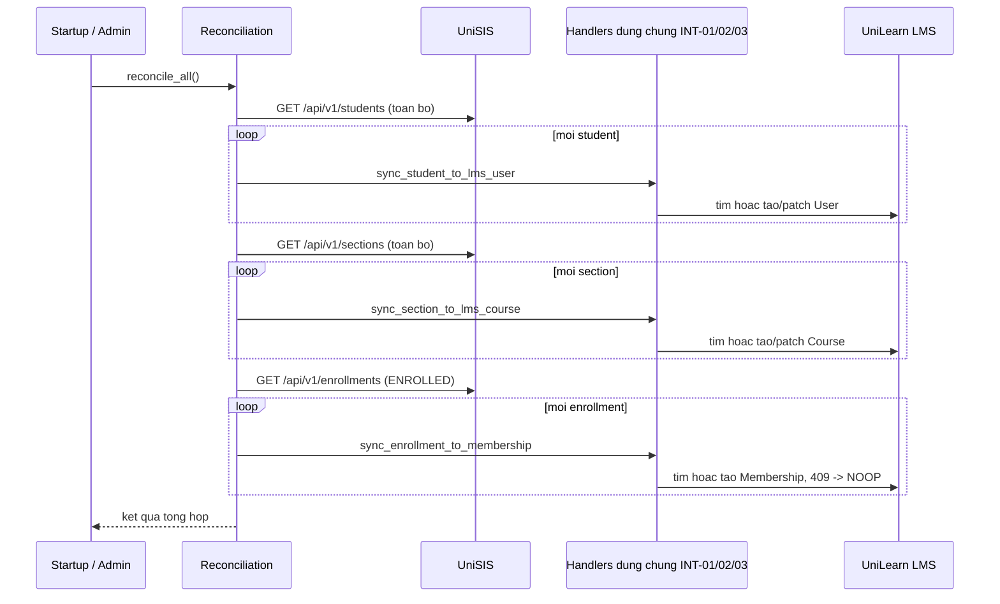

# Sequence Diagrams

## 1. INT-01 happy path (student.created → LMS User)

## 2. INT-03 với dependency chưa sẵn sàng (out-of-order) rồi tự phục hồi

## 3. Retry/backoff khi UniLearn trả 503 rồi 429 (NFR-02/03/12)

## 4. Idempotency khi cùng event được giao 3 lần

## 5. Reconciliation sweep (NFR-06, bootstrap dữ liệu có sẵn)

